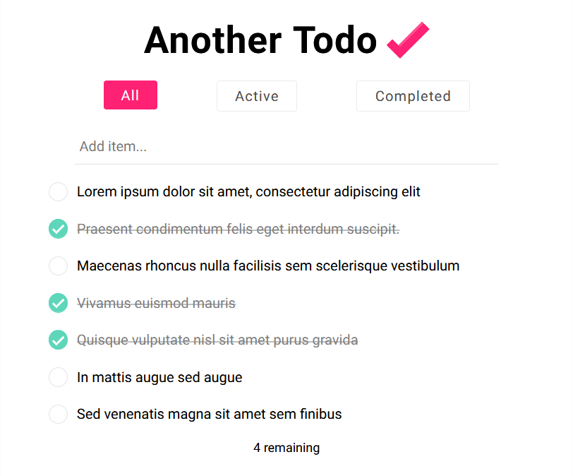

# Another Todo App

A simple project to refamiliarise myself working with React, Node and Express, whilst learning MongoDB.



## Prerequisites 

### MongoDB

You will need to deploy your database to the cloud using [MongoDB Atlas](https://docs.atlas.mongodb.com/getting-started/).

Next, replace the contents of the `uri` variable under `./src/server/config/db.js` with your [MongoDB connection string](https://docs.mongodb.com/guides/cloud/connectionstring/).

## Quick Start

```bash
# Install dependencies
npm install

# Start development server
npm run dev

# Build for production
npm run build

# Start production server
npm start
```
